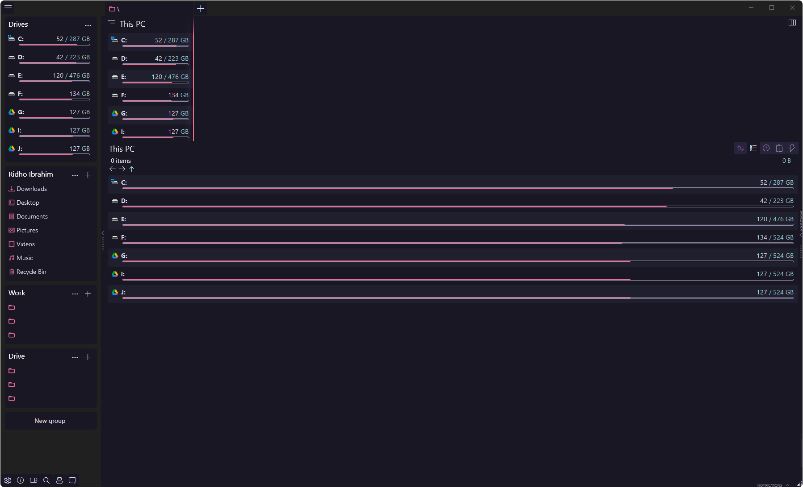
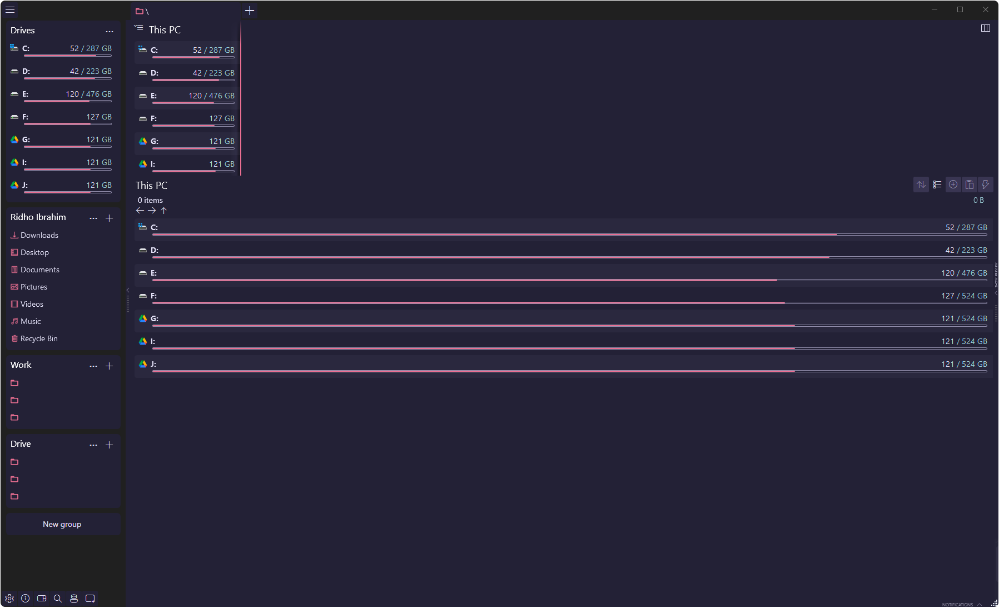
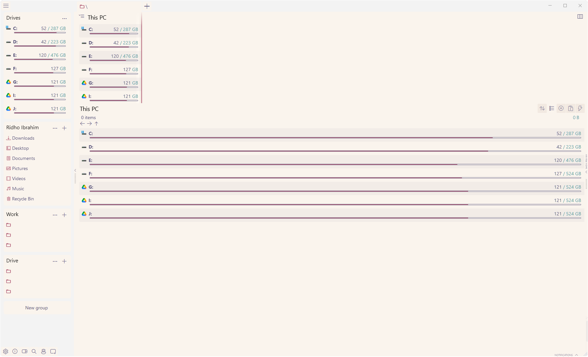

<p align="center">
    
    <h2 align="center">Soho Vibes for OneCommander</h2>
</p>

<p align="center">All natural pine, faux fur and a bit of soho vibes for the classy minimalist</p>

<p align="center">
    <a href="https://github.com/rose-pine/rose-pine-theme">
        
    </a>
</p>

## Usage

### 1. Locate the Themes Folder

You can open the theme directory from within OneCommander:
```
Settings → Personalization → Theme → Open Theme Folder
```

Or manually navigate to:

```
C:\Users\<YourUsername>\AppData\Local\OneCommander\Themes
```

### 2. Install the Themes

1. Download or clone this repository:

```bash
git clone https://github.com/tandukuda/rose-pine-onecommander.git
```

2. Copy the full folder into the `Themes` directory.

3. Launch OneCommander and go to:
```
Settings → Personalization → Theme
```
Select your desired variant:
- [Rosé Pine](https://github.com/tandukuda/rose-pine-onecommander/tree/main/Ros%C3%A9%20Pine)
- [Rosé Pine Moon](https://github.com/tandukuda/rose-pine-onecommander/tree/main/Ros%C3%A9%20Pine%20Moon)
- [Rosé Pine Dawn](https://github.com/tandukuda/rose-pine-onecommander/tree/main/Ros%C3%A9%20Pine%20Dawn)

### 3. Enable Folder Icon Overrides (Optional)

To apply the custom folder icon pack across your system:

- Toggle `Override All Folder Icons` in the theme settings panel.

> 💡 This will replace all default folder icons with the custom Rosé Pine-styled versions.


## Gallery

**Rosé Pine**


**Rosé Pine Moon**


**Rosé Pine Dawn**



## Thanks

- Inspired by [Abod1960’s OneCommander Dev Theme](https://github.com/Abod1960/One-Commander-Dev-Theme)
- Built with love by [@tandukuda](https://github.com/tandukuda)
- Rosé Pine by [@rose-pine](https://github.com/rose-pine)
